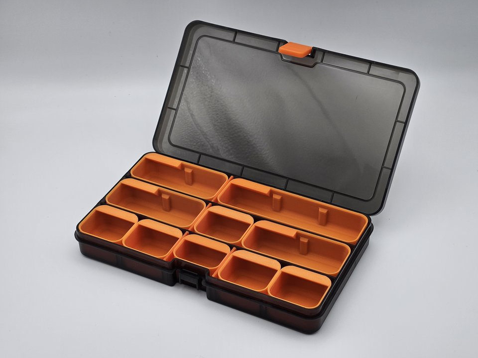
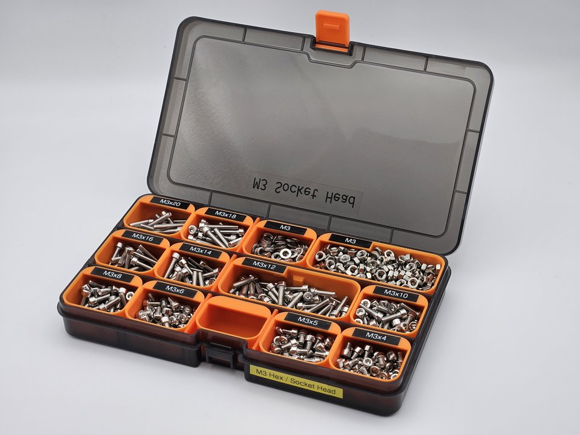
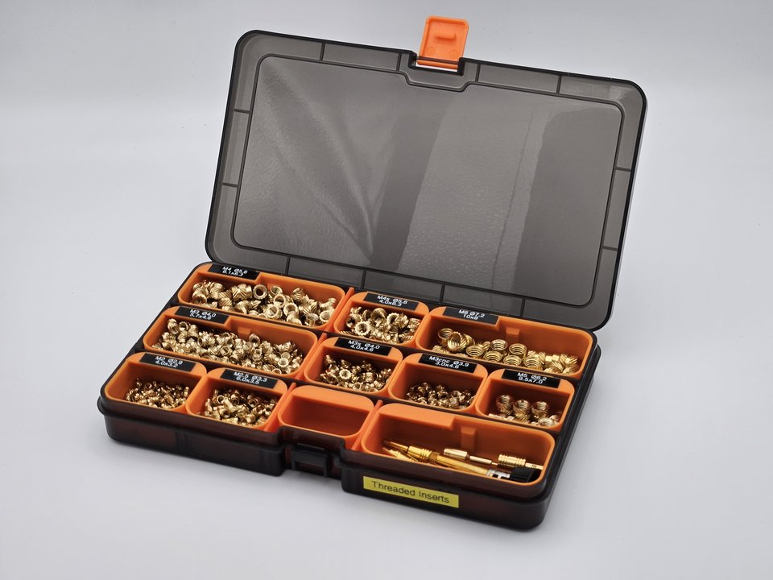
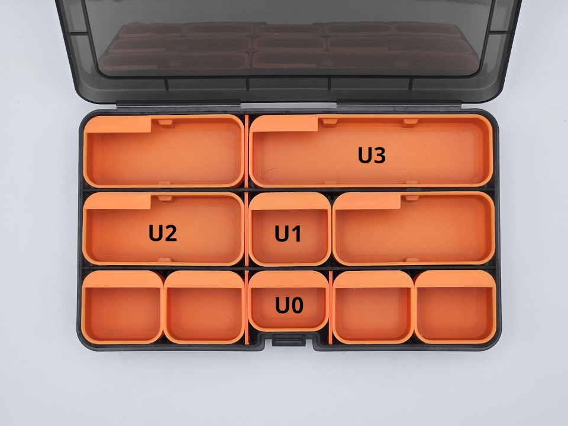
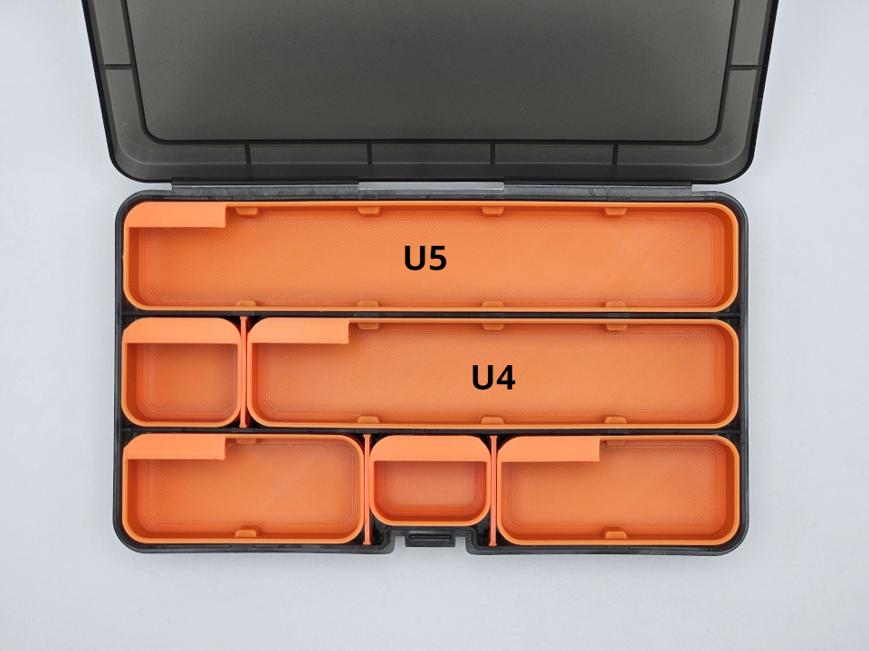

# Someline® Insets

3D printable insets for some Someline® storage boxes.

The insets can be used for small parts storage, such as screws or threaded inserts. Insets can easily be taken out, reorganized, spilled or refilled.

A label tab supports common 6 mm label printer tape.

## Someline® box with 15 compartments

The insets have some tolerances to ease inserting and removing. Therefore, I recommend placing a few walls to balance spacing.

<table cellpadding="0">
  <tr>
    <td>
      
    </td>
    <td>
      
    </td>
    <td>
      
    </td>
    <td>
      
    </td>
    <td>
      
    </td>
  </tr>
</table>

Download model files:

<table width="100%">
  <thead>
    <tr>
      <th>
U0
</th>
      <th>
U1
</th>
      <th>
U2
</th>
      <th>
U3
</th>
      <th>
U4
</th>
      <th>
U5
</th>
    </tr>
  </thead>
  <tbody>
    <tr>
      <td>
        

          <a href="export/someline-15/Someline-15-U0.step">STEP</a> &middot;
          <a href="export/someline-15/Someline-15-U0.stl">STL</a>
        

      </td>
      <td>
        

          <a href="export/someline-15/Someline-15-U1.step">STEP</a> &middot;
          <a href="export/someline-15/Someline-15-U1.stl">STL</a>
        

      </td>
      <td>
        

          <a href="export/someline-15/Someline-15-U2.step">STEP</a> &middot;
          <a href="export/someline-15/Someline-15-U2.stl">STL</a>
        

      </td>
      <td>
        

          <a href="export/someline-15/Someline-15-U3.step">STEP</a> &middot;
          <a href="export/someline-15/Someline-15-U3.stl">STL</a>
        

      </td>
      <td>
        

          <a href="export/someline-15/Someline-15-U4.step">STEP</a> &middot;
          <a href="export/someline-15/Someline-15-U4.stl">STL</a>
        

      </td>
      <td>
        

          <a href="export/someline-15/Someline-15-U5.step">STEP</a> &middot;
          <a href="export/someline-15/Someline-15-U5.stl">STL</a>
        

      </td>
    </tr>
  </tbody>
</table>

## Related links

* [MakerWorld](https://makerworld.com/en/models/706279)
* [Someline® on Amazon](https://www.amazon.de/dp/B08GBPQJBG)

## License

All models, print profiles, and other files, if applicable, are licensed under [Creative Commons Attribution-ShareAlike 4.0 International License](http://creativecommons.org/licenses/by-sa/4.0/).

