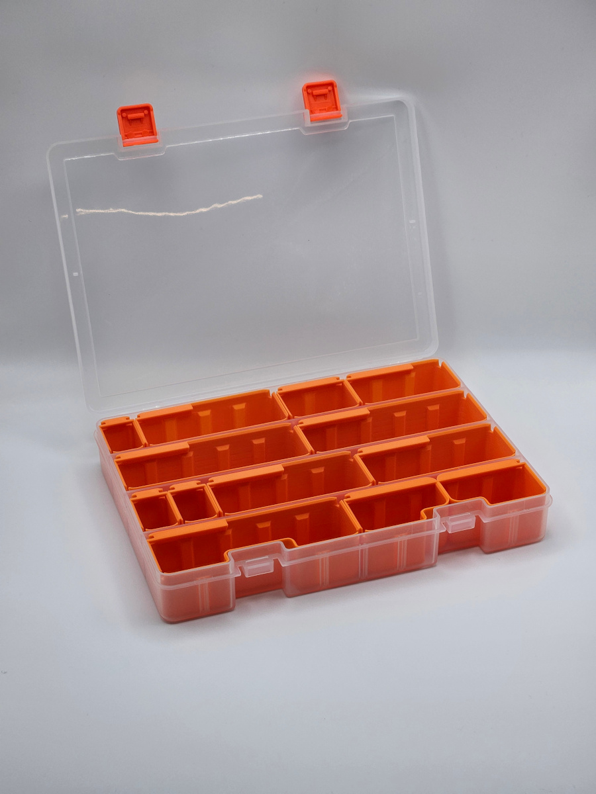
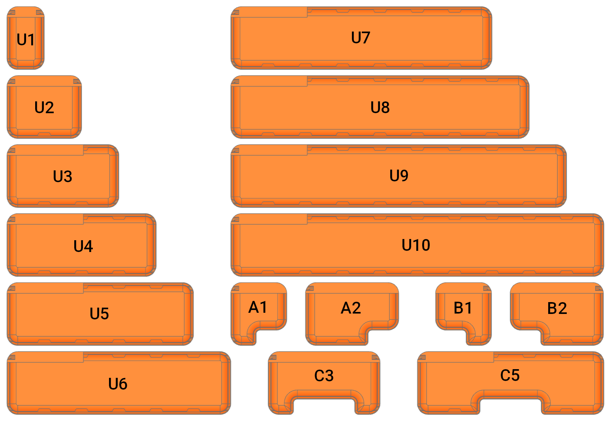

# Someline® Insets

3D printable insets for some Someline® storage boxes.

The insets can be used for small parts storage, such as screws or threaded inserts. Insets can easily be taken out, reorganized, spilled or refilled.

A label tab supports common 6 mm label printer tape.

You can find all models and print profiles on [MakerWorld](https://makerworld.com/en/collections/6267464).

## Someline box with 15 compartments

See: [MakerWorld](https://makerworld.com/en/models/706279) &middot; [Amazon](https://www.amazon.de/dp/B08GBPQJBG)

The insets have some tolerances to ease inserting and removing. Therefore, I recommend placing a few walls to balance spacing.

<table cellpadding="0">
  <tr>
    <td>
      
    </td>
    <td>
      
    </td>
    <td>
      
    </td>
    <td>
      
    </td>
    <td>
      
    </td>
  </tr>
</table>

## Someline box with 36 compartments

See: [MakerWorld](https://makerworld.com/en/models/1383525) &middot; [Amazon](https://www.amazon.de/dp/B07R8SM128)

  <table cellpadding="0">
    <tr>
      <td>
        
      </td>
      <td>
        
      </td>
    </tr>
  </table>

## Related links

* [MakerWorld Collection](https://makerworld.com/en/collections/6267464)

## License

All models, print profiles, and other files, if applicable, are licensed under [Creative Commons Attribution-ShareAlike 4.0 International License](http://creativecommons.org/licenses/by-sa/4.0/).

